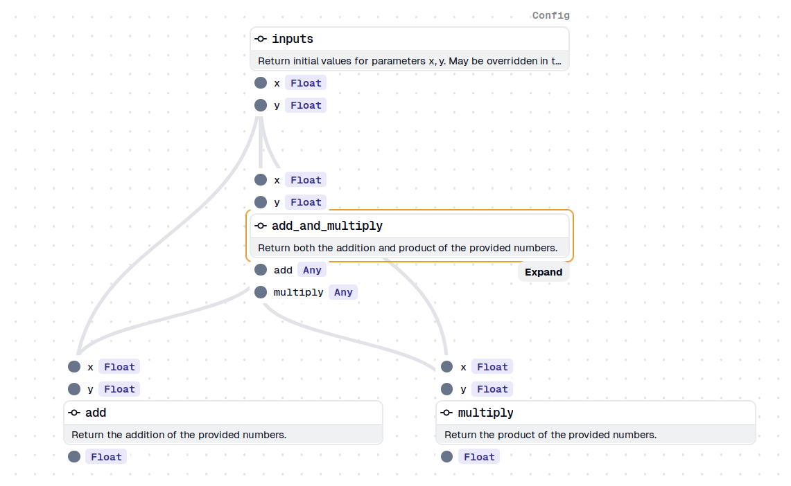

<p align="center">
    
</p>

# Dagster Composable Graphs

[Dagster](https://github.com/dagster-io/dagster) is a cloud-native data
pipeline orchestrator for the whole development lifecycle, with integrated
lineage and observability, a declarative programming model, and best-in-class
testability.

This library provides additional functionality to define dagster jobs from a
file in `.yaml` format and may be used with any other package that integrates
with dagster.

Visit [the documentation here](https://docs.truevoid.dev).

Partially inspired by post *Abstracting Pipelines for Analysts with a YAML DSL*
[on the dagster blog](https://dagster.io/blog/simplisafe-case-study).

## Example

Consider the following definition of a `ComposableGraph`. Notice in particular
sections `inputs`, `operations` and `dependencies`. Respectively these define
the graph inputs, which dagster
[ops](https://docs.dagster.io/concepts/ops-jobs-graphs/ops#ops) or
[graphs](https://docs.dagster.io/concepts/ops-jobs-graphs/graphs#op-graphs) are
part of the job, and their dependencies.

```yaml
apiVersion: truevoid.dev/v1alpha1
kind: ComposableGraph
metadata:
  name: concatenate-graphs
spec:
  inputs:
    x: 2.0
    y: 5.0
  operations:
    - name: add_and_multiply
      function: example.jobs.add_and_multiply
    - name: add
      function: example.jobs.add
    - name: multiply
      function: example.jobs.multiply
  dependencies:
    - name: add_and_multiply
      inputs:
        - x
        - y
    - name: add
      inputs:
        - node: add_and_multiply
          pointer: /add
        - x
    - name: multiply
      inputs:
        - y
        - node: add_and_multiply
          pointer: /multiply
```

Results in the following job, visualized using dagster webserver UI:

<p align="center">
    
</p>
